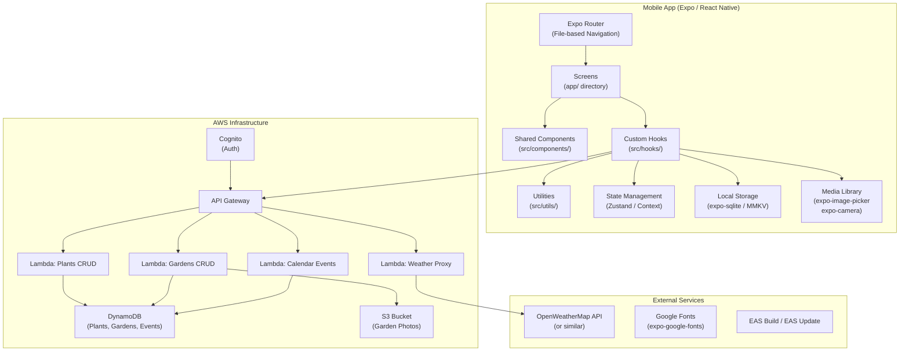
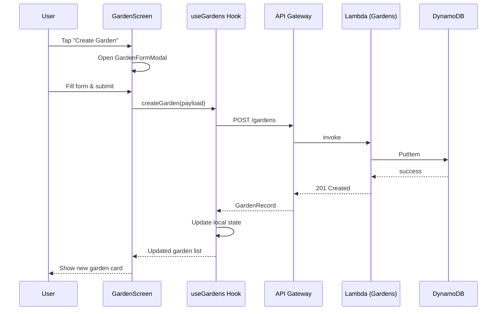
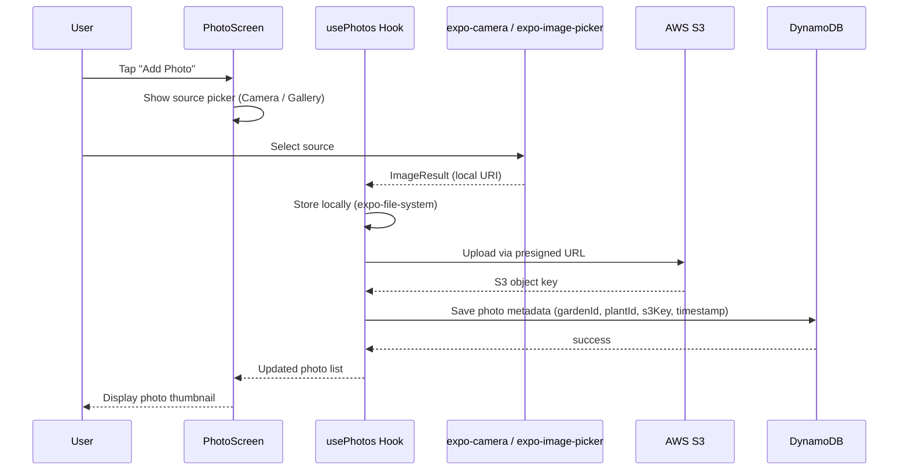
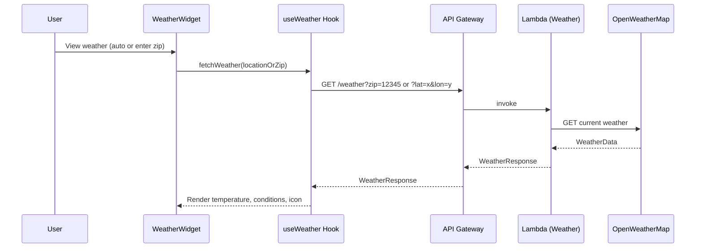
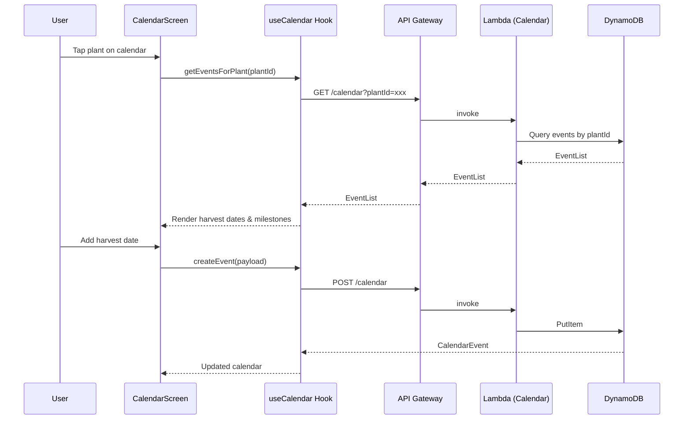

# Design Document: Garden Tracker App

## Overview

The Garden Tracker App is a React Native (Expo) mobile application that lets users plan, visualize, and track their gardens. Users can design garden layouts on a drawable 1/4" grid, manage plants and garden records, capture or import photos, track harvest calendars, and check local weather — all backed by AWS infrastructure for cloud persistence.

The app follows a composite component architecture using Expo Router for file-based navigation, AWS Lambda + API Gateway for serverless API calls, and AWS S3/DynamoDB for data storage. It is built with TypeScript throughout, documented with JSDoc/TSDoc, and deployed via EAS Build and EAS Update.

---

## Architecture



---

## Sequence Diagrams

### Garden CRUD Flow



### Photo Capture & Storage Flow



### Weather Lookup Flow



### Calendar / Harvest Tracking Flow



---

## Components and Interfaces

### GardenGrid

**Purpose**: Renders an interactive 1/4" grid canvas where users draw and edit their garden layout. Supports touch-based drawing, erasing, and plant placement.

**Interface**:

```typescript
interface GardenGridProps {
  /** Width of the grid in inches */
  widthInches: number
  /** Height of the grid in inches */
  heightInches: number
  /** Current cell state map: key = "row:col", value = CellState */
  cells: Record<string, CellState>
  /** Active drawing tool */
  activeTool: DrawingTool
  /** Called when a cell is toggled by user interaction */
  onCellChange: (row: number, col: number, state: CellState) => void
  /** Optional: read-only mode */
  readOnly?: boolean
}

type DrawingTool = 'draw' | 'erase' | 'place_plant' | 'select'

interface CellState {
  filled: boolean
  plantId?: string
  color?: string
}
```

**Responsibilities**:

- Render a scrollable SVG/Canvas grid at 1/4" cell resolution
- Handle pan gesture for multi-cell drawing
- Highlight cells containing placed plants
- Emit `onCellChange` for each modified cell

---

### PlantCard

**Purpose**: Displays a summary of a single plant record with quick-action buttons.

**Interface**:

```typescript
interface PlantCardProps {
  plant: Plant
  onEdit: (plant: Plant) => void
  onDelete: (plantId: string) => void
  onViewPhotos: (plantId: string) => void
}
```

**Responsibilities**:

- Render plant name, species, variety
- Show thumbnail of most recent photo if available
- Provide edit and delete affordances

---

### GardenCard

**Purpose**: Displays a summary card for a garden record.

**Interface**:

```typescript
interface GardenCardProps {
  garden: Garden
  onPress: (gardenId: string) => void
  onEdit: (garden: Garden) => void
  onDelete: (gardenId: string) => void
}
```

**Responsibilities**:

- Show garden name, type, size
- Navigate to garden detail/grid view on press

---

### PhotoPicker

**Purpose**: Composite component for capturing or selecting photos.

**Interface**:

```typescript
interface PhotoPickerProps {
  /** Called with the local URI of the selected/captured image */
  onImageSelected: (uri: string) => void
  /** Maximum number of images selectable from gallery */
  maxGallerySelection?: number
}
```

**Responsibilities**:

- Present action sheet: "Take Photo" vs "Choose from Gallery"
- Request camera/media library permissions via `expo-image-picker`
- Return local URI to parent via callback

---

### WeatherWidget

**Purpose**: Displays current weather conditions for the user's location or a given zip code.

**Interface**:

```typescript
interface WeatherWidgetProps {
  /** Zip code override; if omitted, uses device location */
  zipCode?: string
  /** Compact mode for embedding in dashboard */
  compact?: boolean
}
```

**Responsibilities**:

- Invoke `useWeather` hook to fetch data
- Render temperature, condition description, weather icon
- Show loading skeleton and error state

---

### CalendarView

**Purpose**: Monthly calendar view with plant event markers.

**Interface**:

```typescript
interface CalendarViewProps {
  /** Events to display on the calendar */
  events: CalendarEvent[]
  /** Called when user taps a date */
  onDayPress: (date: string) => void
  /** Called when user taps an event marker */
  onEventPress: (event: CalendarEvent) => void
}
```

**Responsibilities**:

- Render monthly grid with event dots
- Support swipe navigation between months
- Highlight today's date

---

### FormModal

**Purpose**: Reusable bottom-sheet modal wrapping form content.

**Interface**:

```typescript
interface FormModalProps {
  visible: boolean
  title: string
  onClose: () => void
  children: React.ReactNode
}
```

**Responsibilities**:

- Animate in/out as a bottom sheet
- Provide consistent header with title and close button
- Handle keyboard avoidance

---

## Data Models

### Plant

```typescript
interface Plant {
  /** UUID, generated client-side */
  id: string
  /** User-defined display name */
  name: string
  /** Botanical or common species name */
  species: string
  /** Cultivar or variety name */
  variety: string
  /** ISO 8601 creation timestamp */
  createdAt: string
  /** ISO 8601 last-updated timestamp */
  updatedAt: string
}
```

**Validation Rules**:

- `name`: required, 1–100 characters
- `species`: required, 1–100 characters
- `variety`: optional, max 100 characters

---

### Garden

```typescript
interface Garden {
  /** UUID */
  id: string
  /** User-defined garden name */
  name: string
  /** e.g. "raised_bed" | "in_ground" | "container" | "greenhouse" */
  type: GardenType
  /** Human-readable size label, e.g. "4x8 ft" */
  size: string
  /** Precise dimensions for grid rendering */
  dimensions: GardenDimensions
  /** ISO 8601 creation timestamp */
  createdAt: string
  /** ISO 8601 last-updated timestamp */
  updatedAt: string
}

type GardenType =
  | 'raised_bed'
  | 'in_ground'
  | 'container'
  | 'greenhouse'
  | 'other'

interface GardenDimensions {
  /** Width in inches */
  widthInches: number
  /** Height/depth in inches */
  heightInches: number
}
```

**Validation Rules**:

- `name`: required, 1–100 characters
- `type`: required, must be a valid `GardenType`
- `dimensions.widthInches`: required, positive integer, max 1200 (100 ft)
- `dimensions.heightInches`: required, positive integer, max 1200

---

### CalendarEvent

```typescript
interface CalendarEvent {
  /** UUID */
  id: string
  /** Associated plant */
  plantId: string
  /** Associated garden (optional) */
  gardenId?: string
  /** e.g. "planted" | "fertilized" | "harvested" | "watered" | "custom" */
  eventType: EventType
  /** ISO 8601 date string (date only, no time) */
  date: string
  /** Optional user notes */
  notes?: string
  createdAt: string
  updatedAt: string
}

type EventType =
  | 'planted'
  | 'fertilized'
  | 'harvested'
  | 'watered'
  | 'pruned'
  | 'custom'
```

---

### Photo

```typescript
interface Photo {
  /** UUID */
  id: string
  /** Associated garden */
  gardenId?: string
  /** Associated plant */
  plantId?: string
  /** Local file URI (expo-file-system) */
  localUri: string
  /** S3 object key after upload */
  s3Key?: string
  /** ISO 8601 timestamp */
  takenAt: string
  /** Optional caption */
  caption?: string
}
```

---

### WeatherResponse

```typescript
interface WeatherResponse {
  /** City or locality name */
  location: string
  /** Temperature in Fahrenheit */
  temperatureF: number
  /** Temperature in Celsius */
  temperatureC: number
  /** Short condition label, e.g. "Partly Cloudy" */
  condition: string
  /** Icon code for rendering weather icon */
  iconCode: string
  /** Relative humidity percentage */
  humidity: number
  /** Wind speed in mph */
  windSpeedMph: number
  /** ISO 8601 timestamp of observation */
  observedAt: string
}
```

---

## Algorithmic Pseudocode

### Garden Grid Rendering Algorithm

```typescript
ALGORITHM renderGardenGrid(widthInches, heightInches, cells)
INPUT:
  widthInches: number   -- garden width in inches
  heightInches: number  -- garden height in inches
  cells: Record<string, CellState>  -- sparse map of filled cells
OUTPUT: SVG/Canvas element

BEGIN
  ASSERT widthInches > 0 AND heightInches > 0

  cols ← widthInches * 4        -- 4 cells per inch (1/4" grid)
  rows ← heightInches * 4

  ASSERT cols <= 4800 AND rows <= 4800  -- max 100ft x 100ft

  FOR row FROM 0 TO rows - 1 DO
    FOR col FROM 0 TO cols - 1 DO
      key ← `${row}:${col}`
      cellState ← cells[key] ?? { filled: false }
      renderCell(row, col, cellState)
    END FOR
  END FOR

  RETURN renderedGrid
END
```

**Preconditions**:

- `widthInches` and `heightInches` are positive integers
- `cells` is a valid sparse map (may be empty)

**Postconditions**:

- Every cell in the grid is rendered exactly once
- Cells present in `cells` map are rendered with their stored state
- Cells absent from `cells` map are rendered as empty

**Loop Invariants**:

- All previously rendered cells remain correctly displayed
- `key` uniquely identifies each cell as `"row:col"`

---

### Touch Drawing Algorithm

```typescript
ALGORITHM handleDrawGesture(gesture, activeTool, cells)
INPUT:
  gesture: GestureEvent   -- pan or tap gesture from user
  activeTool: DrawingTool
  cells: Record<string, CellState>
OUTPUT: updated cells map

BEGIN
  touchPoint ← gesture.absolutePosition
  cellCoords ← screenCoordsToCellCoords(touchPoint)

  IF cellCoords IS NULL THEN
    RETURN cells  -- touch outside grid bounds
  END IF

  { row, col } ← cellCoords
  key ← `${row}:${col}`

  IF activeTool = 'draw' THEN
    cells[key] ← { filled: true }
  ELSE IF activeTool = 'erase' THEN
    DELETE cells[key]
  ELSE IF activeTool = 'place_plant' THEN
    ASSERT selectedPlantId IS NOT NULL
    cells[key] ← { filled: true, plantId: selectedPlantId }
  END IF

  RETURN cells
END
```

**Preconditions**:

- `gesture` contains valid screen coordinates
- `activeTool` is a valid `DrawingTool` value

**Postconditions**:

- For `draw`: target cell is marked filled
- For `erase`: target cell is removed from map
- For `place_plant`: target cell is filled with `plantId` reference
- All other cells remain unchanged

---

### Photo Upload Algorithm

```typescript
ALGORITHM uploadPhoto(localUri, gardenId, plantId)
INPUT:
  localUri: string    -- local file URI from expo-image-picker
  gardenId?: string
  plantId?: string
OUTPUT: Photo record

BEGIN
  ASSERT localUri IS NOT NULL AND localUri.startsWith('file://')

  // Step 1: Request presigned URL from API
  presignedResponse ← await apiClient.post('/photos/presign', {
    contentType: 'image/jpeg',
    gardenId,
    plantId
  })

  ASSERT presignedResponse.uploadUrl IS NOT NULL
  ASSERT presignedResponse.s3Key IS NOT NULL

  // Step 2: Upload binary to S3
  fileBlob ← await readFileAsBlob(localUri)
  uploadResult ← await fetch(presignedResponse.uploadUrl, {
    method: 'PUT',
    body: fileBlob,
    headers: { 'Content-Type': 'image/jpeg' }
  })

  ASSERT uploadResult.status = 200

  // Step 3: Persist metadata
  photo ← await apiClient.post('/photos', {
    s3Key: presignedResponse.s3Key,
    localUri,
    gardenId,
    plantId,
    takenAt: new Date().toISOString()
  })

  RETURN photo
END
```

**Preconditions**:

- `localUri` is a valid local file URI
- Network is available
- User is authenticated (Cognito token present)

**Postconditions**:

- File is stored in S3 under `presignedResponse.s3Key`
- Photo metadata record exists in DynamoDB
- Returned `Photo` object contains both `localUri` and `s3Key`

**Loop Invariants**: N/A (no loops)

---

### Weather Fetch Algorithm

```typescript
ALGORITHM fetchWeather(zipCode?, coordinates?)
INPUT:
  zipCode?: string          -- 5-digit US zip code
  coordinates?: { lat: number; lon: number }
OUTPUT: WeatherResponse

BEGIN
  ASSERT zipCode IS NOT NULL OR coordinates IS NOT NULL

  IF zipCode IS NOT NULL THEN
    queryParam ← `zip=${zipCode}`
  ELSE
    queryParam ← `lat=${coordinates.lat}&lon=${coordinates.lon}`
  END IF

  response ← await apiClient.get(`/weather?${queryParam}`)

  ASSERT response.status = 200
  ASSERT response.data.temperatureF IS NOT NULL

  RETURN response.data as WeatherResponse
END
```

**Preconditions**:

- At least one of `zipCode` or `coordinates` is provided
- `zipCode` matches pattern `/^\d{5}$/` if provided
- `coordinates.lat` is in range [-90, 90] and `coordinates.lon` in [-180, 180]

**Postconditions**:

- Returns a fully populated `WeatherResponse`
- `observedAt` reflects the time of the weather observation

---

### Plant CRUD Validation Algorithm

```typescript
ALGORITHM validatePlant(input)
INPUT: input: Partial<Plant>
OUTPUT: ValidationResult

BEGIN
  errors ← []

  IF input.name IS NULL OR input.name.trim().length = 0 THEN
    errors.push({ field: 'name', message: 'Name is required' })
  ELSE IF input.name.trim().length > 100 THEN
    errors.push({ field: 'name', message: 'Name must be 100 characters or fewer' })
  END IF

  IF input.species IS NULL OR input.species.trim().length = 0 THEN
    errors.push({ field: 'species', message: 'Species is required' })
  ELSE IF input.species.trim().length > 100 THEN
    errors.push({ field: 'species', message: 'Species must be 100 characters or fewer' })
  END IF

  IF input.variety IS NOT NULL AND input.variety.length > 100 THEN
    errors.push({ field: 'variety', message: 'Variety must be 100 characters or fewer' })
  END IF

  IF errors.length > 0 THEN
    RETURN { valid: false, errors }
  END IF

  RETURN { valid: true, errors: [] }
END
```

**Preconditions**:

- `input` is a defined object (may have missing fields)

**Postconditions**:

- Returns `{ valid: true }` if and only if all required fields pass validation
- Returns `{ valid: false, errors }` with at least one error entry otherwise
- No mutations to `input`

**Loop Invariants**: N/A

---

## Key Functions with Formal Specifications

### `useGardens` Hook

```typescript
/**
 * Hook for managing garden CRUD operations and local state.
 *
 * @returns Garden list, loading state, error state, and CRUD actions
 */
function useGardens(): {
  gardens: Garden[]
  isLoading: boolean
  error: Error | null
  createGarden: (payload: CreateGardenPayload) => Promise<Garden>
  updateGarden: (id: string, payload: UpdateGardenPayload) => Promise<Garden>
  deleteGarden: (id: string) => Promise<void>
  refreshGardens: () => Promise<void>
}
```

**Preconditions**:

- User is authenticated
- Network available for remote operations (local cache used otherwise)

**Postconditions**:

- `createGarden`: new `Garden` appended to `gardens` list; persisted to DynamoDB
- `updateGarden`: matching `Garden` in list updated in-place; persisted to DynamoDB
- `deleteGarden`: matching `Garden` removed from list; deleted from DynamoDB
- `refreshGardens`: `gardens` reflects current server state

---

### `usePlants` Hook

```typescript
/**
 * Hook for managing plant CRUD operations.
 *
 * @returns Plant list, loading state, error state, and CRUD actions
 */
function usePlants(): {
  plants: Plant[]
  isLoading: boolean
  error: Error | null
  createPlant: (payload: CreatePlantPayload) => Promise<Plant>
  updatePlant: (id: string, payload: UpdatePlantPayload) => Promise<Plant>
  deletePlant: (id: string) => Promise<void>
}
```

**Preconditions**:

- User is authenticated

**Postconditions**:

- `createPlant`: new `Plant` appended to `plants`; persisted remotely
- `updatePlant`: matching `Plant` updated; persisted remotely
- `deletePlant`: matching `Plant` removed; deleted remotely; associated `CalendarEvent` records orphaned (soft-delete pattern)

---

### `useWeather` Hook

```typescript
/**
 * Hook for fetching and caching current weather data.
 *
 * @param options - Zip code or coordinates for weather lookup
 * @returns Weather data, loading state, and error state
 */
function useWeather(options: WeatherOptions): {
  weather: WeatherResponse | null
  isLoading: boolean
  error: Error | null
  refetch: () => void
}

interface WeatherOptions {
  zipCode?: string
  useDeviceLocation?: boolean
}
```

**Preconditions**:

- At least one of `zipCode` or `useDeviceLocation` is truthy
- If `useDeviceLocation` is true, location permission has been granted

**Postconditions**:

- `weather` is populated on success
- `error` is set on failure; `weather` remains null
- Results are cached for 10 minutes to avoid redundant API calls

---

### `useCalendar` Hook

```typescript
/**
 * Hook for managing plant calendar events.
 *
 * @param plantId - Optional filter by plant
 * @returns Events list and CRUD actions
 */
function useCalendar(plantId?: string): {
  events: CalendarEvent[]
  isLoading: boolean
  error: Error | null
  createEvent: (payload: CreateEventPayload) => Promise<CalendarEvent>
  updateEvent: (
    id: string,
    payload: UpdateEventPayload
  ) => Promise<CalendarEvent>
  deleteEvent: (id: string) => Promise<void>
}
```

**Preconditions**:

- User is authenticated
- `plantId` is a valid UUID if provided

**Postconditions**:

- `events` is filtered by `plantId` when provided
- `createEvent`: new event appended and persisted
- `deleteEvent`: event removed from list and deleted remotely

---

### `useGardenGrid` Hook

```typescript
/**
 * Hook encapsulating garden grid state and drawing logic.
 * Extracted because it is used in GardenGridScreen and GardenPreviewCard.
 *
 * @param initialCells - Pre-existing cell state (e.g. loaded from DB)
 * @returns Grid state and interaction handlers
 */
function useGardenGrid(initialCells?: Record<string, CellState>): {
  cells: Record<string, CellState>
  activeTool: DrawingTool
  setActiveTool: (tool: DrawingTool) => void
  handleCellChange: (row: number, col: number, state: CellState) => void
  clearGrid: () => void
  exportGridSnapshot: () => string // base64 PNG
}
```

**Preconditions**:

- `initialCells` is a valid sparse map or undefined

**Postconditions**:

- `cells` reflects all user-applied changes since mount
- `exportGridSnapshot` returns a valid base64-encoded PNG string
- `clearGrid` resets `cells` to empty map

---

### `usePhotos` Hook

```typescript
/**
 * Hook for photo capture, gallery selection, and upload management.
 * Used in PhotoGalleryScreen and PlantDetailScreen.
 *
 * @param context - Scope photos to a garden or plant
 * @returns Photos list and capture/upload actions
 */
function usePhotos(context: { gardenId?: string; plantId?: string }): {
  photos: Photo[]
  isLoading: boolean
  error: Error | null
  capturePhoto: () => Promise<void>
  pickFromGallery: () => Promise<void>
  deletePhoto: (photoId: string) => Promise<void>
}
```

**Preconditions**:

- Camera and media library permissions granted before calling `capturePhoto` / `pickFromGallery`

**Postconditions**:

- `capturePhoto`: new `Photo` added to list; uploaded to S3; metadata in DynamoDB
- `pickFromGallery`: same as `capturePhoto` but source is gallery
- `deletePhoto`: photo removed from list; S3 object deleted; DynamoDB record deleted

---

## Example Usage

### Creating a Garden with Grid

```typescript
// GardenCreateScreen.tsx
import { useGardens } from '@/hooks/useGardens';
import { useGardenGrid } from '@/hooks/useGardenGrid';
import { GardenGrid } from '@/components/GardenGrid';

export default function GardenCreateScreen() {
  const { createGarden } = useGardens();
  const { cells, activeTool, setActiveTool, handleCellChange } = useGardenGrid();

  const handleSubmit = async (formValues: CreateGardenPayload) => {
    const garden = await createGarden({
      ...formValues,
      gridSnapshot: cells,
    });
    router.push(`/gardens/${garden.id}`);
  };

  return (
    <View>
      <GardenGrid
        widthInches={formValues.dimensions.widthInches}
        heightInches={formValues.dimensions.heightInches}
        cells={cells}
        activeTool={activeTool}
        onCellChange={handleCellChange}
      />
      <DrawingToolbar activeTool={activeTool} onToolChange={setActiveTool} />
      <SubmitButton onPress={() => handleSubmit(formValues)} />
    </View>
  );
}
```

### Adding a Plant and Scheduling Harvest

```typescript
// PlantDetailScreen.tsx
import { usePlants } from '@/hooks/usePlants';
import { useCalendar } from '@/hooks/useCalendar';

export default function PlantDetailScreen({ plantId }: { plantId: string }) {
  const { plants } = usePlants();
  const { events, createEvent } = useCalendar(plantId);

  const plant = plants.find(p => p.id === plantId);

  const scheduleHarvest = async (date: string) => {
    await createEvent({
      plantId,
      eventType: 'harvested',
      date,
      notes: 'Expected harvest date',
    });
  };

  return (
    <View>
      <PlantCard plant={plant} />
      <CalendarView
        events={events}
        onDayPress={scheduleHarvest}
        onEventPress={(event) => console.log(event)}
      />
    </View>
  );
}
```

### Weather Widget Usage

```typescript
// DashboardScreen.tsx
import { WeatherWidget } from '@/components/WeatherWidget';

export default function DashboardScreen() {
  return (
    <ScrollView>
      <WeatherWidget useDeviceLocation compact />
      {/* or: <WeatherWidget zipCode="90210" /> */}
    </ScrollView>
  );
}
```

---

## Correctness Properties

_A property is a characteristic or behavior that should hold true across all valid executions of a system — essentially, a formal statement about what the system should do. Properties serve as the bridge between human-readable specifications and machine-verifiable correctness guarantees._

### Property 1: Garden Dimensions Validity

For any garden record, the dimensions must satisfy `widthInches > 0 ∧ heightInches > 0 ∧ widthInches ≤ 1200 ∧ heightInches ≤ 1200`. Any garden that violates these bounds must be rejected by the Validator before reaching the API.

**Validates: Requirements 2.4, 2.5**

### Property 2: Plant Field Validation

For any plant input, the Validator must reject it when `name` is empty, whitespace-only, or exceeds 100 characters; when `species` is empty, whitespace-only, or exceeds 100 characters; or when `variety` exceeds 100 characters. For any plant input where all fields are within bounds and non-empty, the Validator must accept it.

**Validates: Requirements 1.2, 1.3, 1.4, 1.5, 1.6**

### Property 3: Calendar Event Referential Integrity

For all calendar events returned by `useCalendar(plantId)`, every event in the result set must have `event.plantId === plantId`. Events whose associated plant has been deleted must not appear in normal calendar views.

**Validates: Requirements 4.2, 4.6**

### Property 4: Photo Upload Atomicity

For any photo where the S3 presigned URL request fails or the S3 PUT returns a non-200 status, no DynamoDB metadata record is created. The photo remains local-only with `s3Key` unset until a successful upload completes.

**Validates: Requirements 5.6, 5.7, 9.5**

### Property 5: Grid Plant Reference Integrity

For all grid cells where `cell.plantId ≠ undefined`, `cell.plantId` must reference a valid `Plant.id` in the current plants collection. Any placement attempt using an invalid or non-existent `plantId` must be rejected.

**Validates: Requirements 3.6**

### Property 6: Weather Cache Freshness

For any weather fetch, the resulting `WeatherResponse` is cached in LocalStorage with a timestamp. While the cached entry is less than 10 minutes old, no new API call is made. When the cached entry is 10 or more minutes old, a background refresh is triggered.

**Validates: Requirements 6.4, 6.5, 6.6**

### Property 7: Grid Cell Count Invariant

For any garden grid with valid dimensions `(widthInches, heightInches)` where both are positive integers, the total number of rendered cells equals exactly `(widthInches × 4) × (heightInches × 4)`, and each cell is rendered exactly once per render pass.

**Validates: Requirements 3.1, 3.7**

### Property 8: CRUD Idempotency

For any garden and any update payload, calling `updateGarden` with the same payload twice produces the same final garden state as calling it once. The operation is idempotent.

**Validates: Requirements 2.9**

### Property 9: Plant Validation Round-Trip

For any valid `Plant` object (name 1–100 chars, species 1–100 chars, variety ≤ 100 chars), `validatePlant` returns `{ valid: true }`. For any `Plant` object that violates any field constraint, `validatePlant` returns `{ valid: false }` with at least one error entry. The function never mutates its input.

**Validates: Requirements 1.2, 1.3, 1.4, 1.5, 1.6**

### Property 10: Data Serialization Round-Trip

For any valid `Plant`, `Garden`, `CalendarEvent`, or `Photo` object, serializing to JSON and then deserializing must produce an object that is structurally equivalent to the original. No data is lost or corrupted through the serialize → deserialize cycle.

**Validates: Requirements 10.1, 10.2**

### Property 11: Grid Drawing Tool Invariants

For any grid state and any valid cell coordinates `(row, col)`:

- Applying the `draw` tool results in `cells["row:col"].filled === true`
- Applying the `erase` tool results in `cells["row:col"]` being absent from the map
- Applying the `place_plant` tool with a valid `plantId` results in `cells["row:col"] = { filled: true, plantId }`
- All other cells in the map remain unchanged after any single tool application

**Validates: Requirements 3.2, 3.3, 3.4**

### Property 12: Out-of-Bounds Touch Invariant

For any touch coordinates that fall outside the grid's rendered bounds, the cell map must remain unchanged after the gesture is processed.

**Validates: Requirements 3.5**

### Property 13: Hook Error Isolation

For any error thrown within a hook's async operation, the hook must set its `error` state to the thrown error and must not propagate an unhandled exception that would crash the application. The hook's other state values remain accessible.

**Validates: Requirements 9.3**

### Property 14: Offline Mutation Queuing

For any create, update, or delete mutation attempted while the device has no network connectivity, the mutation must be added to the local queue and must not be silently dropped. The queue must be durable across app restarts.

**Validates: Requirements 8.2**

### Property 15: PlantCard Photo Display

For any plant that has one or more associated photos, the rendered `PlantCard` must include a thumbnail derived from the most recent photo. For any plant with no associated photos, no thumbnail is rendered.

**Validates: Requirements 5.9**

### Property 16: Weather Widget Required Fields

For any successfully fetched `WeatherResponse`, the rendered `WeatherWidget` must display the temperature value, the condition description string, and a weather icon. No required field may be silently omitted from the rendered output.

**Validates: Requirements 6.3**

### Property 17: Sign-Out Cache Clearing

For any authenticated session with any amount of locally cached data, calling sign-out must result in an empty local cache. No user-specific data from the previous session must remain accessible after sign-out completes.

**Validates: Requirements 7.5**

---

## Error Handling

### Network Unavailable

**Condition**: API Gateway unreachable (no internet, timeout)
**Response**: Hooks return cached local data; UI shows "Offline" banner
**Recovery**: Automatic retry with exponential backoff on reconnect; pending mutations queued locally

### Photo Upload Failure

**Condition**: S3 presigned URL request fails or PUT to S3 returns non-200
**Response**: `usePhotos` sets `error` state; photo stored locally only; UI shows retry option
**Recovery**: User can retry upload; local photo remains accessible

### Location Permission Denied

**Condition**: User denies location permission for weather
**Response**: `useWeather` prompts for zip code fallback; no crash
**Recovery**: User enters zip code manually; preference saved to local storage

### Invalid Garden Dimensions

**Condition**: User submits `widthInches` or `heightInches` ≤ 0 or > 1200
**Response**: `validateGarden` returns validation error; form shows inline error message
**Recovery**: User corrects input; no API call made until valid

### Lambda / DynamoDB Error

**Condition**: Lambda returns 5xx or DynamoDB throttles
**Response**: API client throws; hook sets `error` state; UI shows error toast
**Recovery**: Retry button available; exponential backoff for automatic retries

---

## Testing Strategy

### Unit Testing Approach

Test each hook and utility function in isolation using Jest + React Native Testing Library.

Key test cases:

- `validatePlant`: empty name, name > 100 chars, missing species, valid input
- `validateGarden`: zero dimensions, negative dimensions, valid input
- `useGardenGrid`: cell draw, cell erase, plant placement, clear grid
- `screenCoordsToCellCoords`: boundary coordinates, out-of-bounds coordinates

### Property-Based Testing Approach

**Property Test Library**: `fast-check`

Properties to test:

- For any valid `Plant` input, `validatePlant` returns `{ valid: true }`
- For any `name` with `length > 100`, `validatePlant` returns `{ valid: false }`
- For any grid dimensions `(w, h)` where `w > 0 ∧ h > 0`, `renderGardenGrid` produces exactly `w*4 * h*4` cells
- For any sequence of draw/erase operations, the final cell map is consistent with the last operation applied to each cell

### Integration Testing Approach

- Mock AWS Lambda responses with MSW (Mock Service Worker) for API integration tests
- Test full CRUD flows: create → read → update → delete for `Plant` and `Garden`
- Test photo upload flow with mocked S3 presigned URL and fetch

---

## Performance Considerations

- **Grid rendering**: Use `react-native-skia` or `react-native-svg` with virtualization for large grids (> 100×100 cells); only render visible cells in the viewport
- **Photo thumbnails**: Generate and cache thumbnails locally using `expo-image-manipulator` before upload; display local URI immediately while upload proceeds in background
- **Weather caching**: Cache responses for 10 minutes in MMKV to avoid redundant Lambda invocations
- **DynamoDB**: Use single-table design with composite keys (`PK: USER#userId`, `SK: GARDEN#gardenId`) for efficient queries
- **Bundle size**: Use `expo-google-fonts` with selective font loading; avoid importing entire icon sets

---

## Security Considerations

- **Authentication**: All API Gateway routes protected by Cognito JWT authorizer; tokens refreshed automatically via `amazon-cognito-identity-js`
- **S3 access**: Photos accessed only via short-lived presigned URLs (15-minute expiry); bucket is private
- **Input sanitization**: All user text inputs sanitized before DynamoDB writes; Lambda validates payload schema with Zod
- **Location data**: Device coordinates sent only to the app's own Lambda proxy; never forwarded to third parties directly
- **EAS secrets**: API keys and AWS credentials stored as EAS environment secrets; never bundled in the app binary

---

## Dependencies

| Package                                  | Purpose                                |
| ---------------------------------------- | -------------------------------------- |
| `expo` ~55                               | Core Expo SDK                          |
| `expo-router` ~6                         | File-based navigation                  |
| `expo-camera`                            | Camera capture                         |
| `expo-image-picker`                      | Gallery selection                      |
| `expo-image-manipulator`                 | Thumbnail generation                   |
| `expo-file-system`                       | Local file storage                     |
| `expo-location`                          | Device GPS coordinates                 |
| `expo-sqlite`                            | Local relational cache                 |
| `react-native-mmkv`                      | Fast key-value local storage           |
| `react-native-skia`                      | High-performance grid canvas           |
| `react-native-reanimated` ~4             | Gesture animations                     |
| `react-native-gesture-handler`           | Touch gesture recognition              |
| `@shopify/flash-list`                    | Virtualized lists                      |
| `react-native-calendars`                 | Calendar UI component                  |
| `zustand`                                | Lightweight global state               |
| `zod`                                    | Runtime schema validation              |
| `aws-amplify`                            | Cognito auth + API client              |
| `@expo-google-fonts/*`                   | Google Fonts integration               |
| `fast-check`                             | Property-based testing                 |
| `jest` + `@testing-library/react-native` | Unit & integration tests               |
| `eas-cli`                                | EAS Build & EAS Update deployment      |
| `tailwindcss`                            | styling                                |
| `uniwind`                                | native extension for tailwind          |
| `tailwind-variants`                      | utility for clean tailwindcss          |
| `eslint`                                 | for following consistent code patterns |
| `prettier`                               | for IDE code formatting                |
