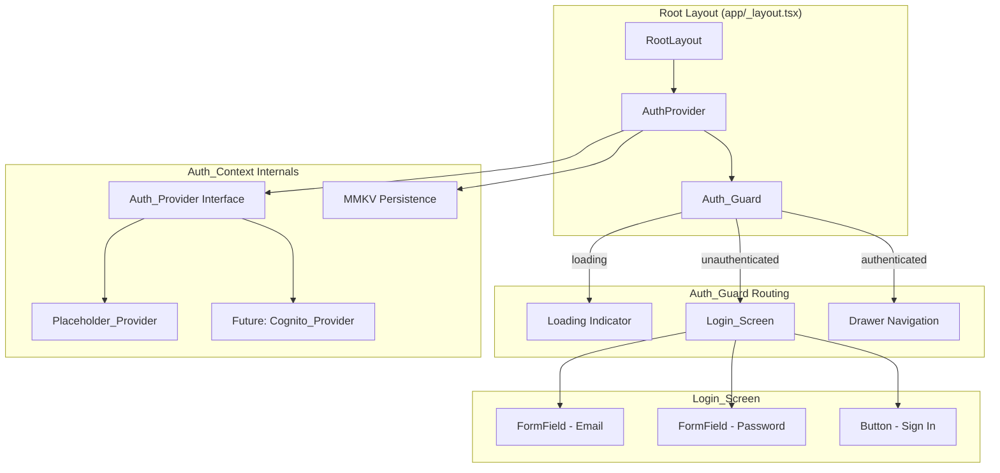

# Design Document: LoFi Login Screen

## Overview

This design establishes the authentication layer for the Garden Tracker app using a provider-based abstraction pattern. The system introduces an `Auth_Provider` interface consumed by an `Auth_Context` React context, which gates navigation via an `Auth_Guard` in the root layout. The initial implementation uses a `Placeholder_Provider` that simulates authentication locally, enabling full UI and flow development without a backend. The architecture supports a future swap to a `Cognito_Provider` backed by `aws-amplify` (already in dependencies) without modifying any consuming components.

The Login_Screen renders a centered email/password form using the existing `FormField` and `Button` components, styled with NativeWind/tailwind-variants to match the app's visual language.

## Architecture



**Data flow:**
1. App launches → `Auth_Context` reads persisted session from MMKV
2. If valid session exists → state = `authenticated` → Auth_Guard renders drawer
3. If no session → state = `unauthenticated` → Auth_Guard renders Login_Screen
4. User submits credentials → Auth_Context delegates to Auth_Provider.signIn()
5. On success → state = `authenticated`, session persisted to MMKV
6. On sign-out → Auth_Provider.signOut() called, MMKV cleared, state = `unauthenticated`

## Components and Interfaces

### Auth_Provider Interface

```typescript
// src/types/TAuthProvider.ts

interface IAuthSession {
  accessToken: string;
  refreshToken: string;
  expiresAt: number; // Unix timestamp (seconds)
  groups: string[];  // IAM group memberships
}

interface ISignInCredentials {
  email: string;
  password: string;
}

interface IAuthProvider {
  signIn: (credentials: ISignInCredentials) => Promise<IAuthSession>;
  signOut: () => Promise<void>;
  getSession: () => Promise<IAuthSession | null>;
  refreshSession: () => Promise<IAuthSession>;
}
```

### Auth_Context

```typescript
// src/features/auth/AuthContext.tsx

type AuthStatus = 'loading' | 'authenticated' | 'unauthenticated';

interface IAuthContextValue {
  status: AuthStatus;
  session: IAuthSession | null;
  groups: string[];
  signIn: (credentials: ISignInCredentials) => Promise<void>;
  signOut: () => Promise<void>;
}
```

The context provider accepts an `IAuthProvider` instance as a prop, enabling dependency injection. On mount, it reads persisted state from MMKV via the `getSession` method pattern. State transitions trigger MMKV writes/clears.

### Placeholder_Provider

```typescript
// src/features/auth/PlaceholderProvider.ts

const PlaceholderProvider: IAuthProvider = {
  signIn: async (_credentials) => ({
    accessToken: 'placeholder-access-token',
    refreshToken: 'placeholder-refresh-token',
    expiresAt: Math.floor(Date.now() / 1000) + 3600,
    groups: [],
  }),
  signOut: async () => {},
  getSession: async () => null, // Delegates to MMKV-based restoration
  refreshSession: async () => ({
    accessToken: 'placeholder-access-token-refreshed',
    refreshToken: 'placeholder-refresh-token',
    expiresAt: Math.floor(Date.now() / 1000) + 3600,
    groups: [],
  }),
};
```

### Auth_Guard

Located in the root layout, the Auth_Guard conditionally renders based on `Auth_Context.status`:

| Status | Renders |
|--------|---------|
| `loading` | Full-screen loading indicator |
| `unauthenticated` | Login_Screen |
| `authenticated` | Existing drawer navigation + PageHeader |

### Login_Screen

```typescript
// src/features/auth/LoginScreen.tsx

interface ILoginScreenProps {
  // No props — consumes Auth_Context internally
}
```

**Component tree:**
- `View` (centered container, max-w-[480px] on wide viewports)
  - `Text` (heading — app name, Manrope-Bold)
  - `FormField` (email — keyboardType="email-address", autoCapitalize="none", autoComplete="email")
  - `FormField` (password — secureTextEntry, autoComplete="password")
  - `Text` (error message — conditional, above button area)
  - `Button` (sign-in — disabled + loading indicator while processing)

**Responsive behavior:**
- Viewports > 480px: form constrained to `max-w-[480px]`, centered
- Viewports ≤ 480px: full width with `px-4` (16px horizontal padding)

### File Structure

```
src/
├── features/
│   └── auth/
│       ├── AuthContext.tsx        # React context provider
│       ├── AuthGuard.tsx          # Navigation gating component
│       ├── LoginScreen.tsx        # Login form UI
│       ├── PlaceholderProvider.ts # Local dev auth provider
│       └── types.ts              # Re-exports from src/types/TAuthProvider
├── types/
│   └── TAuthProvider.ts          # Auth_Provider, Auth_Session interfaces
app/
├── _layout.tsx                   # Modified: wraps with AuthProvider + AuthGuard
```

## Data Models

### Auth_Session (persisted to MMKV)

```typescript
interface IAuthSession {
  accessToken: string;
  refreshToken: string;
  expiresAt: number;   // Unix timestamp in seconds
  groups: string[];    // IAM group memberships (empty for placeholder)
}
```

**MMKV storage key:** `auth_session`

**Serialization:** JSON via existing `storage.set<T>()` / `storage.get<T>()` helpers in `src/lib/storage.ts`.

### Validation Schema (Zod)

```typescript
import { z } from 'zod';

const loginFormSchema = z.object({
  email: z.string().trim().min(1, 'Email is required'),
  password: z.string().trim().min(1, 'Password is required'),
});

const authSessionSchema = z.object({
  accessToken: z.string().min(1),
  refreshToken: z.string().min(1),
  expiresAt: z.number().int().positive(),
  groups: z.array(z.string()),
});
```

The `loginFormSchema` validates form submission (requirement 3.2). The `authSessionSchema` validates persisted data on app launch to detect corrupt state (requirement 6.4).

## Correctness Properties

*A property is a characteristic or behavior that should hold true across all valid executions of a system — essentially, a formal statement about what the system should do. Properties serve as the bridge between human-readable specifications and machine-verifiable correctness guarantees.*

### Property 1: Controlled input reflects user input

*For any* string value typed into the email or password form field, the component's displayed value SHALL equal the input string exactly.

**Validates: Requirements 2.1, 2.2**

### Property 2: Valid credentials invoke provider and transition to authenticated

*For any* email and password pair where both contain at least one non-whitespace character, invoking signIn SHALL call the Auth_Provider's signIn method with those exact credentials and, upon successful resolution, transition the auth status to `authenticated`.

**Validates: Requirements 3.1**

### Property 3: Whitespace-only inputs are rejected with validation errors

*For any* string composed entirely of whitespace characters (including empty string) in the email field, the password field, or both, attempting to submit the form SHALL not invoke the Auth_Provider and SHALL produce a validation error for each invalid field.

**Validates: Requirements 3.2**

### Property 4: Auth_Session persistence round-trip

*For any* valid `IAuthSession` object (conforming to the authSessionSchema), persisting it to MMKV and then reading it back SHALL produce an object deeply equal to the original, and the Auth_Context SHALL expose the same `groups` array from the restored session.

**Validates: Requirements 6.1, 6.2, 8.9**

### Property 5: Corrupt or missing persisted state defaults to unauthenticated

*For any* string value stored in the MMKV `auth_session` key that does not conform to the `authSessionSchema` (including malformed JSON, missing fields, wrong types, or an absent key), the Auth_Context SHALL set status to `unauthenticated`.

**Validates: Requirements 6.4**

## Error Handling

| Scenario | Behavior |
|----------|----------|
| Sign-in provider rejects | Re-enable button, display generic error message above form ("Unable to sign in. Please try again.") |
| Sign-out provider rejects | Still clear local MMKV state, transition to unauthenticated, render Login_Screen |
| MMKV read fails / corrupt data | Treat as no session — set state to unauthenticated |
| MMKV write fails | Log warning, do not block authentication flow (session still valid in memory) |
| Network timeout (future Cognito) | Provider rejects → same as sign-in failure path |

**Design decision:** Sign-out always clears local state regardless of provider errors. This prevents users from being "stuck" in an authenticated state when the backend is unreachable. The local-first approach ensures the app remains usable.

## Testing Strategy

### Unit Tests (example-based)

- **Login_Screen rendering:** Verify form elements present, correct props (keyboardType, autoCapitalize, autoComplete, secureTextEntry)
- **Auth_Guard routing:** Verify correct component rendered for each auth status (loading, authenticated, unauthenticated)
- **Loading states:** Verify loading indicator during auth check and sign-in processing
- **Error display:** Verify error message appears on sign-in failure, button re-enabled
- **Sign-out flow:** Verify provider called, MMKV cleared, state transitions
- **Placeholder_Provider:** Verify returns valid Auth_Session shape with required fields

### Property-Based Tests (fast-check)

The project already includes `fast-check` in dependencies. Each property test runs a minimum of 100 iterations.

| Property | Generator Strategy |
|----------|-------------------|
| Property 1: Controlled input | `fc.string()` for arbitrary input strings |
| Property 2: Valid credentials | `fc.string().filter(s => s.trim().length > 0)` for email and password |
| Property 3: Whitespace rejection | `fc.stringOf(fc.constantFrom(' ', '\t', '\n', '\r'))` for whitespace-only strings |
| Property 4: Session round-trip | `fc.record({ accessToken: fc.string({minLength:1}), refreshToken: fc.string({minLength:1}), expiresAt: fc.nat(), groups: fc.array(fc.string()) })` |
| Property 5: Corrupt state | `fc.oneof(fc.string(), fc.json())` filtered to exclude valid sessions |

**Tag format:** `Feature: lofi-login-screen, Property {N}: {title}`

### Integration Tests

- Auth_Context with Placeholder_Provider: full sign-in → persist → restore → sign-out cycle
- Auth_Guard with real Auth_Context: navigation gating end-to-end

### Test File Locations

```
src/features/auth/__tests__/
├── LoginScreen.test.tsx
├── AuthContext.test.tsx
├── AuthGuard.test.tsx
├── AuthContext.property.test.tsx   # Properties 2-5
├── LoginScreen.property.test.tsx   # Property 1
└── PlaceholderProvider.test.ts
```
