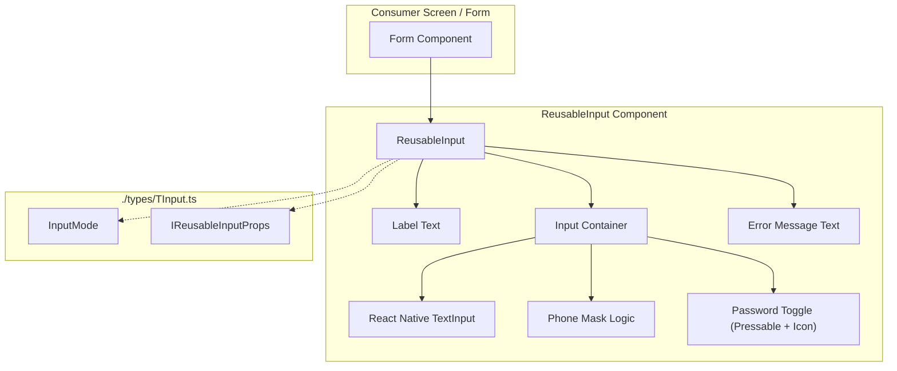
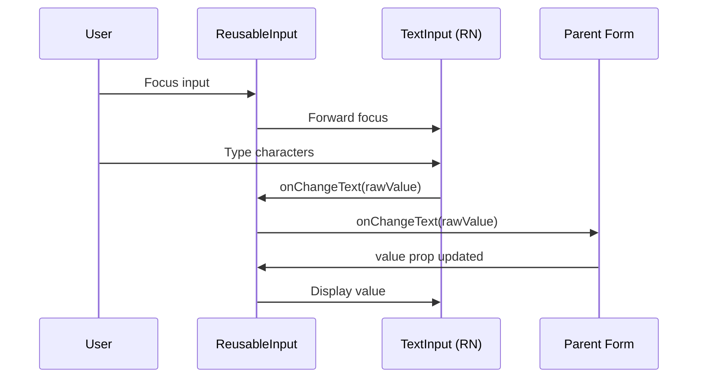
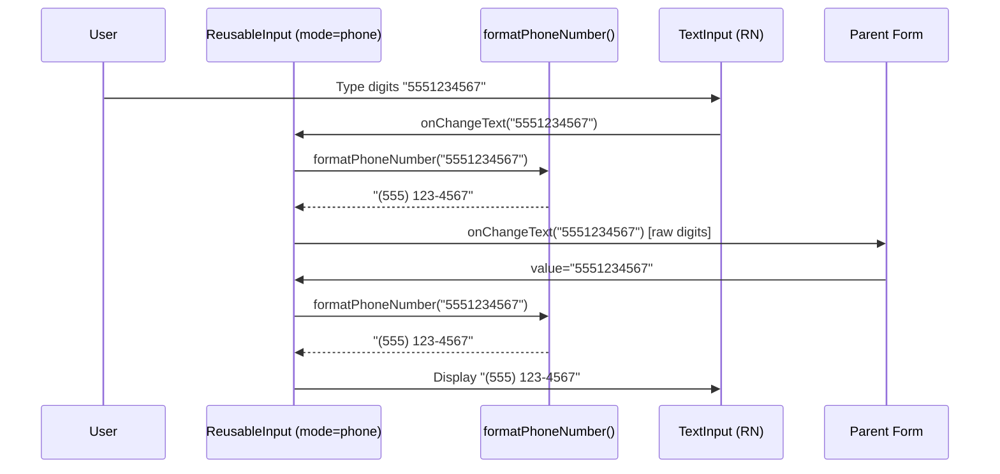
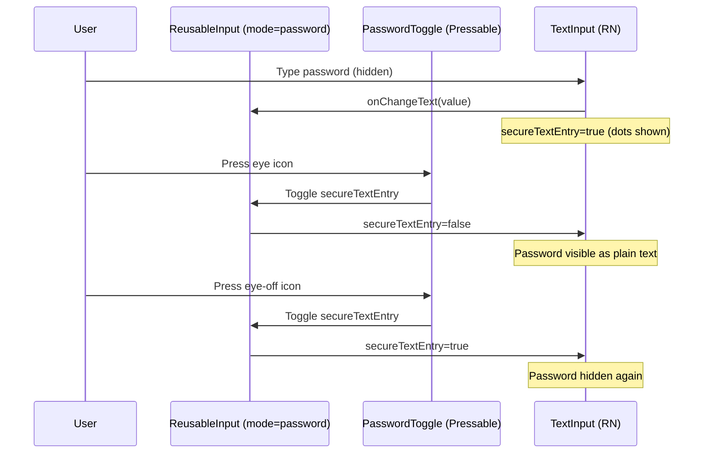

# Design Document: Reusable Input Component

## Overview

The Reusable Input Component is a unified, accessible text input for the Garden Tracker app that supports three input modes: plain text, phone (with formatting/masking), and password (with show/hide toggle). It replaces the existing incomplete `Input.tsx` with a fully-featured, type-safe component that follows the project's established patterns — named exports, `tailwind-variants` for styling, `className` prop for consumer overrides, and types extracted to `./types`.

The component is designed for cross-platform use (iOS, Android, Web) via React Native + NativeWind, with responsive sizing and full accessibility support including labels, hints, and error announcements.

---

## Architecture



---

## Sequence Diagrams

### Text Input Flow



### Phone Input Flow (with masking)



### Password Input Flow (with toggle)



---

## Components and Interfaces

### ReusableInput

**Purpose**: A single, configurable input component that adapts its behavior based on the `mode` prop. Handles text, phone, and password input with consistent styling, accessibility, and error display.

**Interface**:

```typescript
interface IReusableInputProps {
  /** Input mode determines behavior and keyboard type */
  mode: InputMode
  /** Label displayed above the input */
  label: string
  /** Current input value (raw, unformatted for phone mode) */
  value: string
  /** Change handler — receives raw value (digits only for phone) */
  onChangeText: (text: string) => void
  /** Placeholder text */
  placeholder?: string
  /** Error message — when present, shows error styling and message */
  error?: string
  /** Whether the input is disabled */
  disabled?: boolean
  /** Whether the field is required (appends * to label) */
  required?: boolean
  /** Additional className for the outermost wrapper */
  className?: string
  /** Maximum character length */
  maxLength?: number
  /** Accessibility hint for screen readers */
  accessibilityHint?: string
  /** Auto-capitalize behavior */
  autoCapitalize?: 'none' | 'sentences' | 'words' | 'characters'
  /** Whether to show the clear button (text mode only) */
  showClearButton?: boolean
  /** Called when input receives focus */
  onFocus?: () => void
  /** Called when input loses focus */
  onBlur?: () => void
}

type InputMode = 'text' | 'phone' | 'password'
```

**Responsibilities**:

- Render label, input field, and optional error message
- Apply mode-specific behavior (keyboard type, secure entry, masking)
- Manage internal `secureTextEntry` toggle state for password mode
- Format display value for phone mode while emitting raw digits
- Apply disabled styling and prevent interaction when `disabled=true`
- Announce errors to screen readers via `accessibilityLiveRegion`

---

## Data Models

### IReusableInputProps

```typescript
type InputMode = 'text' | 'phone' | 'password'

interface IReusableInputProps {
  mode: InputMode
  label: string
  value: string
  onChangeText: (text: string) => void
  placeholder?: string
  error?: string
  disabled?: boolean
  required?: boolean
  className?: string
  maxLength?: number
  accessibilityHint?: string
  autoCapitalize?: 'none' | 'sentences' | 'words' | 'characters'
  showClearButton?: boolean
  onFocus?: () => void
  onBlur?: () => void
}
```

**Validation Rules**:

- `mode`: required, must be one of `'text' | 'phone' | 'password'`
- `label`: required, non-empty string
- `value`: required, string (empty string is valid)
- `onChangeText`: required, function
- `maxLength`: if provided, must be positive integer
- `error`: when present, triggers error styling regardless of content

---

## Algorithmic Pseudocode

### Phone Number Formatting Algorithm

```typescript
/**
 * Formats a raw digit string into US phone format: (XXX) XXX-XXXX
 * Only digits are retained from input. Formatting is progressive:
 *   1-3 digits  → (XXX
 *   4-6 digits  → (XXX) XXX
 *   7-10 digits → (XXX) XXX-XXXX
 *   >10 digits  → truncated to 10
 */
ALGORITHM formatPhoneNumber(raw: string): string
INPUT: raw — any string (may contain non-digit characters)
OUTPUT: formatted phone string

BEGIN
  digits ← raw.replace(/[^\d]/g, '')

  IF digits.length > 10 THEN
    digits ← digits.substring(0, 10)
  END IF

  IF digits.length === 0 THEN
    RETURN ''
  END IF

  IF digits.length <= 3 THEN
    RETURN `(${digits}`
  END IF

  IF digits.length <= 6 THEN
    RETURN `(${digits.substring(0, 3)}) ${digits.substring(3)}`
  END IF

  RETURN `(${digits.substring(0, 3)}) ${digits.substring(3, 6)}-${digits.substring(6)}`
END
```

**Preconditions**:

- `raw` is a defined string (may be empty)

**Postconditions**:

- Output contains only digits, parentheses, spaces, and hyphens
- Output never exceeds 14 characters: `(XXX) XXX-XXXX`
- Digits in output match the first 10 digits of input (order preserved)
- Empty input produces empty output

**Loop Invariants**: N/A (no loops)

---

### Strip Non-Digits Algorithm

```typescript
/**
 * Extracts only digit characters from a string.
 * Used to normalize phone input before passing to parent.
 */
ALGORITHM stripNonDigits(input: string): string
INPUT: input — any string
OUTPUT: string containing only digit characters [0-9]

BEGIN
  RETURN input.replace(/[^\d]/g, '')
END
```

**Preconditions**:

- `input` is a defined string

**Postconditions**:

- Output contains only characters in range '0'-'9'
- Order of digits is preserved from input
- If input has no digits, output is empty string

---

### Password Visibility Toggle Algorithm

```typescript
/**
 * Manages the secureTextEntry state for password mode.
 * Toggles between visible and hidden password text.
 */
ALGORITHM togglePasswordVisibility(currentState: boolean): boolean
INPUT: currentState — current secureTextEntry value
OUTPUT: inverted boolean

BEGIN
  RETURN NOT currentState
END
```

**Preconditions**:

- `currentState` is a boolean value

**Postconditions**:

- Output is the logical negation of input
- `true` → `false` (password becomes visible)
- `false` → `true` (password becomes hidden)

---

### Input Mode Resolution Algorithm

```typescript
/**
 * Resolves TextInput props based on the current input mode.
 * Determines keyboardType, secureTextEntry, autoComplete, and textContentType.
 */
ALGORITHM resolveInputProps(mode: InputMode, isPasswordVisible: boolean)
INPUT:
  mode — 'text' | 'phone' | 'password'
  isPasswordVisible — whether password is currently shown (only relevant for password mode)
OUTPUT: Partial TextInput props object

BEGIN
  SWITCH mode
    CASE 'text':
      RETURN {
        keyboardType: 'default',
        secureTextEntry: false,
        autoComplete: 'off',
        textContentType: 'none'
      }

    CASE 'phone':
      RETURN {
        keyboardType: 'phone-pad',
        secureTextEntry: false,
        autoComplete: 'tel',
        textContentType: 'telephoneNumber',
        maxLength: 14  // formatted length: (XXX) XXX-XXXX
      }

    CASE 'password':
      RETURN {
        keyboardType: 'default',
        secureTextEntry: NOT isPasswordVisible,
        autoComplete: 'password',
        textContentType: 'password'
      }
  END SWITCH
END
```

**Preconditions**:

- `mode` is a valid `InputMode` value
- `isPasswordVisible` is a boolean

**Postconditions**:

- Returned object contains valid React Native TextInput props
- `secureTextEntry` is `true` only when mode is `'password'` AND `isPasswordVisible` is `false`
- `keyboardType` matches the expected input type for each mode

---

### Change Handler Algorithm

```typescript
/**
 * Processes text changes based on mode before forwarding to parent.
 * For phone mode, strips non-digits. For other modes, passes through.
 */
ALGORITHM handleChange(text: string, mode: InputMode, onChangeText: Function)
INPUT:
  text — raw text from TextInput onChangeText
  mode — current input mode
  onChangeText — parent callback
OUTPUT: void (side effect: calls onChangeText)

BEGIN
  IF mode === 'phone' THEN
    digits ← stripNonDigits(text)
    IF digits.length > 10 THEN
      digits ← digits.substring(0, 10)
    END IF
    onChangeText(digits)
  ELSE
    onChangeText(text)
  END IF
END
```

**Preconditions**:

- `text` is a defined string
- `mode` is a valid `InputMode`
- `onChangeText` is a callable function

**Postconditions**:

- For phone mode: parent receives only digits, max 10 characters
- For text/password mode: parent receives unmodified text
- Parent's `onChangeText` is called exactly once

---

## Key Functions with Formal Specifications

### `ReusableInput` Component

```typescript
const ReusableInput = ({
  mode,
  label,
  value,
  onChangeText,
  placeholder,
  error,
  disabled,
  required,
  className,
  maxLength,
  accessibilityHint,
  autoCapitalize,
  showClearButton,
  onFocus,
  onBlur,
}: IReusableInputProps) => { /* ... */ }
```

**Preconditions**:

- `mode` is one of `'text' | 'phone' | 'password'`
- `label` is a non-empty string
- `value` is a string (raw digits for phone mode)
- `onChangeText` is a function

**Postconditions**:

- Renders an accessible input with label
- When `error` is provided, error styling and message are visible
- When `disabled` is true, input is non-interactive with reduced opacity
- For phone mode, displayed value is formatted; emitted value is raw digits
- For password mode, toggle button controls text visibility

---

### `formatPhoneNumber` Utility

```typescript
const formatPhoneNumber = (raw: string): string => { /* ... */ }
```

**Preconditions**:

- `raw` is a defined string

**Postconditions**:

- Returns formatted string matching pattern `(XXX) XXX-XXXX` for 10 digits
- Returns partial format for fewer digits
- Returns empty string for empty input
- Never returns more than 14 characters

---

### `stripNonDigits` Utility

```typescript
const stripNonDigits = (input: string): string => { /* ... */ }
```

**Preconditions**:

- `input` is a defined string

**Postconditions**:

- Returns string containing only `[0-9]` characters
- Preserves digit order from input

---

## Example Usage

```typescript
// Basic text input
import { ReusableInput } from '@/components/ReusableInput'

const TextExample = () => {
  const [name, setName] = useState('')

  return (
    <ReusableInput
      mode="text"
      label="Garden Name"
      value={name}
      onChangeText={setName}
      placeholder="Enter garden name"
      required
    />
  )
}

// Phone input with formatting
const PhoneExample = () => {
  const [phone, setPhone] = useState('')

  return (
    <ReusableInput
      mode="phone"
      label="Phone Number"
      value={phone}
      onChangeText={setPhone}
      placeholder="(555) 123-4567"
    />
  )
}

// Password input with toggle
const PasswordExample = () => {
  const [password, setPassword] = useState('')

  return (
    <ReusableInput
      mode="password"
      label="Password"
      value={password}
      onChangeText={setPassword}
      placeholder="Enter password"
      error={password.length < 8 ? 'Password must be at least 8 characters' : undefined}
    />
  )
}

// Disabled state
const DisabledExample = () => (
  <ReusableInput
    mode="text"
    label="Read Only"
    value="Cannot edit"
    onChangeText={() => {}}
    disabled
  />
)

// With custom className override
const StyledExample = () => (
  <ReusableInput
    mode="text"
    label="Custom Styled"
    value=""
    onChangeText={() => {}}
    className="mx-4 mt-2"
  />
)
```

---

## Correctness Properties

*A property is a characteristic or behavior that should hold true across all valid executions of a system — essentially, a formal statement about what the system should do. Properties serve as the bridge between human-readable specifications and machine-verifiable correctness guarantees.*

### Property 1: Phone Format Round-Trip Stability

*For any* digit string `d` where `d.length <= 10`, `stripNonDigits(formatPhoneNumber(d)) === d`. Formatting and then stripping produces the original digit string — the formatting function never adds, removes, or reorders digits.

**Validates: Requirements 10.1, 2.2**

### Property 2: Phone Format Output Validity

*For any* input string `s`, `formatPhoneNumber(s).length <= 14` AND the output contains only characters from the set `[0-9() -]`. The formatted output is always bounded and contains only expected formatting characters.

**Validates: Requirements 10.2, 10.3**

### Property 3: Phone Mode Emits Only Digits

*For any* input text processed through the phone mode change handler, the value passed to `onChangeText` matches the pattern `/^\d{0,10}$/`. No non-digit characters or strings longer than 10 digits are ever emitted to the parent.

**Validates: Requirements 2.3, 2.4, 2.5**

### Property 4: Password Toggle Idempotency

*For any* boolean state `s`, applying `togglePasswordVisibility` twice returns the original state: `togglePasswordVisibility(togglePasswordVisibility(s)) === s`.

**Validates: Requirements 3.2, 3.3**

### Property 5: Mode Props Consistency

*For any* valid `InputMode` value and `isPasswordVisible` boolean, `resolveInputProps` returns an object where `secureTextEntry === true` if and only if `mode === 'password'` AND `isPasswordVisible === false`. For all other modes, `secureTextEntry` is always `false`.

**Validates: Requirements 3.1, 3.5, 1.1, 2.1**

### Property 6: Disabled State Rendering

*For any* valid props combination where `disabled === true`, the component renders with `editable={false}` and reduced opacity styling applied, regardless of mode or other prop values.

**Validates: Requirements 6.1, 6.2**

### Property 7: Error Display Consistency

*For any* `IReusableInputProps` where `error` is a non-empty string, the error message text is rendered AND error styling is applied to the input border. *For any* props where `error` is `undefined` or empty string, no error message is rendered AND no error styling is applied.

**Validates: Requirements 5.1, 5.2, 5.3**

### Property 8: Label Accessibility

*For any* rendered `ReusableInput` with a given `label` string, the underlying `TextInput` has `accessibilityLabel` set to the `label` prop value. When `required` is true, the visual label includes an asterisk but the `accessibilityLabel` remains the clean label text without the asterisk.

**Validates: Requirements 4.1, 4.2, 4.3, 7.1**

### Property 9: Controlled Component Display

*For any* `ReusableInput` with `mode !== 'phone'`, the displayed text in the TextInput always equals the `value` prop. *For any* `ReusableInput` with `mode === 'phone'`, the displayed text equals `formatPhoneNumber(value)`. The component is always controlled — the display is a pure function of props.

**Validates: Requirements 9.1, 9.3, 1.2, 1.3, 2.6**

### Property 10: ClassName Merge

*For any* `className` string provided to `ReusableInput`, the outermost wrapper element includes both the default component styles and the consumer-provided classes.

**Validates: Requirements 8.3**

---

## Error Handling

### Error Scenario 1: Invalid Phone Characters

**Condition**: User pastes text containing letters or symbols into phone mode input
**Response**: `stripNonDigits` removes all non-digit characters before processing; only valid digits are forwarded to parent
**Recovery**: Automatic — no user action needed; display shows formatted version of valid digits only

### Error Scenario 2: Exceeding Max Length

**Condition**: User attempts to type beyond `maxLength` or beyond 10 digits in phone mode
**Response**: Input is truncated at the boundary; `onChangeText` is not called with the excess
**Recovery**: Automatic — TextInput's native `maxLength` prop handles truncation

### Error Scenario 3: Validation Error Display

**Condition**: Parent passes a non-empty `error` string prop
**Response**: Input border changes to error color; error message text appears below input; screen reader announces error via `accessibilityLiveRegion="polite"`
**Recovery**: Parent clears `error` prop when validation passes; styling reverts automatically

### Error Scenario 4: Disabled Interaction Attempt

**Condition**: User attempts to tap/focus a disabled input
**Response**: No visual feedback, no focus event, no keyboard shown
**Recovery**: N/A — input remains disabled until parent changes `disabled` prop

---

## Testing Strategy

### Unit Testing Approach

- Test `formatPhoneNumber` with various digit lengths (0, 1-3, 4-6, 7-10, >10)
- Test `stripNonDigits` with mixed character strings
- Test `resolveInputProps` for each mode
- Test component renders label, placeholder, and error correctly
- Test password toggle changes `secureTextEntry`
- Test disabled state prevents interaction
- Test phone mode displays formatted value but emits raw digits

**Library**: `@testing-library/react-native` + `jest`

### Property-Based Testing Approach

- Use `fast-check` (already in project dependencies) to verify:
  - Phone formatting preserves digit content (Property 1)
  - Phone format output never exceeds 14 chars (Property 2)
  - Phone mode only emits digit strings ≤ 10 chars (Property 3)
  - Format round-trip stability (Property 9)

**Property Test Library**: fast-check

### Integration Testing Approach

- Test `ReusableInput` within a form context to verify `onChangeText` integration
- Test keyboard type changes when switching modes
- Test accessibility tree structure with screen reader simulation

---

## Performance Considerations

- Phone formatting runs on every keystroke — the `formatPhoneNumber` function is O(n) where n ≤ 10, so performance impact is negligible
- No `useMemo` needed for formatting since input is bounded to 10 digits
- Password toggle uses local `useState` — no re-renders propagate to parent
- `tailwind-variants` styles are computed once and cached by the library

---

## Security Considerations

- Password mode uses `secureTextEntry` which prevents screenshots on iOS and hides text in recent apps on Android
- `autoComplete="password"` enables secure credential autofill from OS keychain
- `textContentType="password"` on iOS triggers strong password suggestions
- No password values are logged or stored in component state beyond what the parent provides via `value` prop

---

## Dependencies

- `react-native` — `TextInput`, `Text`, `View`, `Pressable` core components
- `tailwind-variants` — Style variant management (already in project)
- `@expo/vector-icons` — Eye/eye-off icons for password toggle (already in project)
- No new dependencies required
